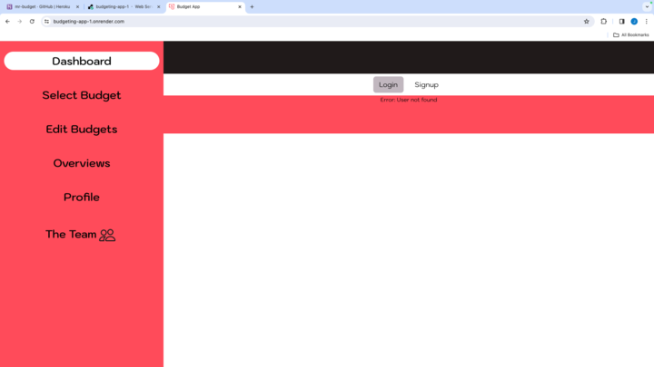

# Mister Budget

## License
  

  This project is licensed under the MIT license.
  
<a href= "https://choosealicense.com/licenses/mit/">link to MIT license</a>

## Description
Mister Budget is a full stack mern budgeting application. It allows users to create budgets depending on their lifestyle, keep track of their expenditures to ensure they stay on track with their set goals, and not exceed their set budget limits. An overview page is provided for users to see their seperates transactions on a pie chart. This provides visualization on their tranactions and insight on how expeditures are affecting their overall budget. Users can also vist the Edit Budgets page to update their budgeting needs depending on the increase or decrease of expeditures. Budget tracking is a very important aspect of life and we hope this application decreases the stress of budgeting so that users can focus on something other than money. So come trust Mister Budget to take care of all your budgeting needs.

## Table of Contents
- [License](#license)
- [Installation](#installation)
- [Usage](#usage)
- [Contributing](#contributing)
- [Links](#links)
- [Questions](#questions)
- [ScreenShots](#screenshots)

## Installation
clone Repository, cd.. into applcation, npm install dependencies, npm run develop to run server.

## Usage
concurrently, nodemon, mongoose, jsonwebtoken, graphql, express, bootstrap, chart.js, react, react-bootstrap, react-chartjs-2, react-dom, react-router-dom, react-icons, sass, vite.

## Contributing
Eric Reyna, Jake Smith, Jordan Burton, Michael Graham

## LINKS
Live Link:
https://budgeting-app-1.onrender.com/

Repo Link:
https://github.com/jordaneburton/budgeting-app
## Questions
For additional questions, you can reach me through:
- GitHub: 
[Ereyna21](https://github.com/Ereyna21),
[jakeshmith](https://github.com/jakeshmith),
[jordaneburton](https://github.com/jordanebuerton),
[mwg396](https://github.com/mwg396)

- Email: Ereyna21075@yahoo.com, jakerusmith@gmail.com, jordane.burton@gmail.com,  Michael.Graham1029@gmail.com

## ScreenShots
